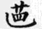
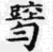
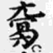

# 古琴減字譜影像辨識模型

這個專案用來辨識古琴減字譜的單字圖片。輸入一張已裁切的譜字影像後，模型會分別預測：

- `String`：弦序相關標籤
- `hui`：徽位相關標籤

每個結果都會同時輸出模型信心值。專案內附已訓練模型 `guqin_model.joblib`，可直接進行推論，也可以用自己的已標註資料重新訓練。

> 目前模型使用 211 筆樣本訓練。模型檔未保存有效的交叉驗證準確率（`String`、`hui` 均為 `null`），因此信心值不應視為實際準確率；建議增加各類別樣本並建立獨立測試集後再用於正式研究。

## 輸入圖片範例

| 範例 1 | 範例 2 | 範例 3 |
| --- | --- | --- |
|  |  |  |

模型接受 PNG、JPG 等 Pillow 可讀取的影像。建議先將譜字裁成單字、保留少量白邊，並避免同一張圖包含多個譜字。

## 模型原理與功能

`guqin.py` 會把輸入圖片做以下處理：

1. 依 EXIF 方向校正並轉成灰階。
2. 自動調整對比，縮放並裁成 64 × 64。
3. 擷取 16 × 16 縮圖像素，以及以 8 × 8 區塊統計的 9 方向梯度特徵（類 HOG）。
4. 分別交給兩個 `ExtraTreesClassifier`，預測 `String` 與 `hui`。
5. 以 JSON 輸出各欄位的預測值與最高分類機率。

訓練時，每個輸出欄位各使用一個 500 棵樹的 Extra Trees 分類器，固定亂數種子為 42，並使用所有 CPU 核心。若各類別樣本數足夠，程式會自動執行最多五折交叉驗證。

## 使用套件

| 套件 | 用途 |
| --- | --- |
| Python 3.10+ | 執行訓練與辨識程式 |
| NumPy | 影像數值運算、梯度與特徵向量 |
| Pillow | 開啟、校正、灰階化與縮放圖片 |
| scikit-learn | Extra Trees 分類器與交叉驗證 |
| joblib | 儲存與載入訓練完成的模型 |
| OpenCV | PDF 前處理工具所需（核心推論不直接使用） |
| PyMuPDF | PDF 前處理工具所需（核心推論不直接使用） |

## 安裝

```bash
python -m venv .venv
```

Windows PowerShell：

```powershell
.\.venv\Scripts\Activate.ps1
python -m pip install -r requirements.txt
```

macOS / Linux：

```bash
source .venv/bin/activate
python -m pip install -r requirements.txt
```

## 直接辨識

```bash
python guqin.py predict data1.png --model guqin_model.joblib
```

輸出格式如下：

```json
{
  "image": "data1.png",
  "prediction": {
    "String": { "value": "預測標籤", "confidence": 0.95 },
    "hui": { "value": "預測標籤", "confidence": 0.90 }
  }
}
```

## 重新訓練

### 使用圖片與 CSV

資料夾中放置圖片及 `labels.csv`：

```text
dataset/images/
├── labels.csv
├── sample_001.png
└── sample_002.png
```

`labels.csv` 至少要有以下欄位：

```csv
image,string,hui
sample_001.png,1,7
sample_002.png,2,8
```

執行：

```bash
python guqin_csv.py dataset/images --model guqin_model.joblib
```

### 使用含內嵌圖片的 Excel

`guqin.py` 也支援讀取第一個工作表中含內嵌圖片及標籤欄位的 `.xlsx`：

```bash
python guqin.py train --excel 古琴資料.xlsx --model guqin_model.joblib
```

原始訓練資料與裁切圖片未放入此倉庫；請使用自己的合法資料重新訓練。

## 專案檔案

- `guqin.py`：影像特徵、Excel 訓練、模型載入與單張圖片辨識。
- `guqin_csv.py`：用圖片資料夾及 `labels.csv` 重新訓練。
- `guqin_model.joblib`：目前已訓練完成的模型。
- `requirements.txt`：Python 套件版本需求。
- `data1.png`～`data3.png`：README 使用的少量輸入範例。

## 注意事項

- `joblib` 模型使用 Python pickle 機制，請勿載入來源不明的模型檔。
- 本模型只適合與訓練資料風格相近、已裁切的古琴減字譜影像。
- 原始 PDF、Excel、完整訓練集、裁切結果與虛擬環境皆由 `.gitignore` 排除。
